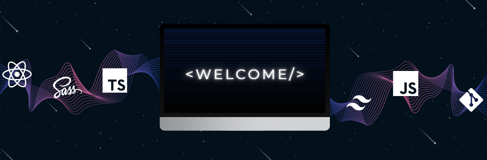

<h3 align="center">Hello, I'm Jodie, a React Developer</h3>

After a 10-month training at [BeCode](https://becode.org/) and a 3-month internship in a company, I'm continuing my learning in the field of web development to enhance my skills. I invite you to discover my projects in the repositories section.

If you want to learn more about me and/or contact me, visit my **[LinkedIn](https://www.linkedin.com/in/jodieaddis/)** and my **[Portfolio](https://portfolio-tau-ten-38.vercel.app/)**.

<h4 align="center">My Tech Skills</h4>

<h4 align="center">My Stats Cards</h4>

<h4 align='center'>Wakatime summary card</h4>

