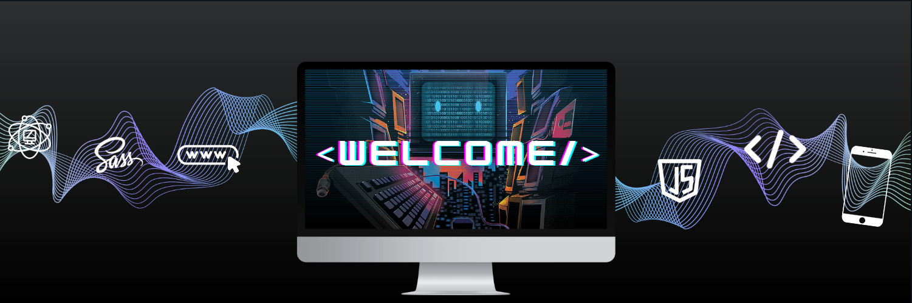

Hi, welcome to my github! I'm Jodie and I'm a junior developer at . My goal is to become a .
Hello, I'm Jodie, and I'm currently undergoing training at [BeCode](https://becode.org/) to become a web developer. My goal is to pursue a career as a **Full FrontEnd developer**. Feel free to check out the projects completed during the training as well as my personal projects :blush: .

<h2 align='center'>My Tech Skills</h2>

    

<h2 align='center'>My Stats Cards</h2>

<!--  -->

<h2 align='center'>Wakatime summary card</h2>

<!--   -->

